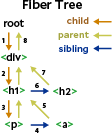

# mini-react

## purpose
I want to understand the internal structure of React. 

## reference
https://github.com/pomber/didact


## Preparation

Install vscode extentions.

- Jest (id: Orta.vscode-jest)
- Live Server (id: ritwickdey.LiveServer)
- Prettier (id: esbenp.prettier-vscode)

## Build

```shell
yarn build
```

## Run

Create html files in `dist/` and open them with Live Server.
For example, you can create index.html file to check if some functions in library can work fine in your browser.
Note that your functions or variables should be exported from `index.js`.

```html
<script src="./bundle.js"></script>

<script>
  let elem = MiniReact.createElement('div', null, 'index');
  console.log(elem);
</script>
<body></body>
```

## Test

Open Jest settings, test files, and run each test.

# Reactの構造

このコードは、Reactの基本的な機能を模倣したシンプルな仕組みを持つライブラリやフレームワークのコア部分です。以下に、コードの主な機能や各部分の説明を示します。

1. **`createElement` 関数:**
   - JSXから呼び出される関数で、Reactの仮想DOM要素を作成します。指定された `type` は要素の種類を表し、`props` はその要素に対するプロパティ、`children` は子要素の配列です。
   - `createTextElement` を使用して、テキストノードを作成し、子要素に含めています。

   - `createElement`を呼び出しできるように、JSX を JS に変換
   
``` JSX
const element = (
  <div id="foo">
    <a>bar</a>
    <b />
  </div>
)
```
``` js
const element = React.createElement(
  "div",
  { id: "foo" },
  React.createElement("a", null, "bar"),
  React.createElement("b")
)
```
   - `createElement("div", null, a, b)`の場合、以下のように返す
``` js
{
  "type": "div",
  "props": { "children": [a, b] }
}
```
   - `children` には `div` のような `element` だけじゃなく、文字列や数値のようなプリミティブな値を含めることもできる。そこで`createTextElement`を使って記述する。

2. **`createTextElement` 関数:**
   - `element`でないものはすべて独自の要素の中に包み込み、そのための特別な型`TEXT_ELEMENT`を作る。
``` js
function createTextElement(text) {
  return {
    type: "TEXT_ELEMENT",
    props: {
      nodeValue: text,
      children: [],
    },
  }
}
```
3. **`render` 関数:**
   - `createTextElement`でdomノードの作成をする。この時、`TEXT_ELEMENT`なら`createTextElement`を使用しテキストノードを作る。そして、`children`の再帰的なレンダリングをし、ノードのコンテナへの追加しレンダリングが終わる。

4. **並行性：`workLoop` 関数:**
   - 再帰的に`render`を呼び出すことで、完全な要素ツリーをレンダリングするまで停止しないため、要素ツリーが大きい場合、メインスレッドが長時間ブロックされる課題がある。そこで、作業を小さな単位に分割し各単位の完了後、他に行う必要がある場合はレンダリングを中断できるようにする。
   - `requestIdleCallback` を使用して、非同期に実行されるレンダリングのメインループ作り(現在は`scheduler`を使用しているが仕組みはほぼ同じ)、`performUnitOfWork` を呼び出してファイバーオブジェクトの作成とDOM要素の追加を進める。

5. **`fiber`:**
   - 作業単位を作成するため、データ構造、つまりファイバーツリーが必要となる。要素ごとに1つのファイバーがあり、各ファイバーが作業単位になる。以下のように実行する。
``` js
miniReact.render(
  <div>
    <h1>
      <p />
      <a />
    </h1>
    <h2 />
  </div>,
  container
)
```


6. **フェーズのレンダリングとコミット:**
   - DOMへの変更は、完全にレンダリングが完了する前にブラウザによって中断される可能性があるため、部分的なUIが表示されないようにする必要がある。
   - `wipRoot`（作業中のルート）を導入し、全ての作業が完了したときに一括してコミットするようにする。コミットは `commitRoot` で行われ、再帰的に全てのノードをDOMに追加する。
```js
function render(element, container) {
  wipRoot = {
    dom: container,
    props: {
      children: [element],
    },
    alternate: currentRoot,
  }
  nextUnitOfWork = wipRoot
}
```

6. **ノードの更新や削除:**
   - 関数で受け取った要素を、`renderDOM` にコミットした最後のファイバー ツリーと比較する必要があ李、ファイバーツリーをDOMにコミットした後、その「最後にDOMにコミットしたファイバーツリー」への参照を保持する必要がある。これは `currentRoot` と呼ばれる。各ファイバーには `alternate` プロパティが追加され、これは前回のコミットフェーズでDOMにコミットされた古いファイバーへのリンクである。

7. **`reconcileChildren` 関数:**
   - 古いファイバーオブジェクトと新しい仮想DOM要素を比較し、変更がある場合に対応するファイバーオブジェクトを作成する。この関数は再帰的に呼び出され、差分を検出する、

8. **`commitWork` 関数:**
   - `commitWork` を変更して、新しい `effectTags` を処理する。ファイバーに `PLACEMENT` エフェクトタグがある場合は、前と同じように、親ファイバーのノードに DOM ノードを追加する。削除（`DELETION`）の場合は、その逆で、子を削除する。また、`UPDATE` の場合は、`updateDom`で既存の DOM ノードを変更されたプロップで更新する必要がある。

10. **`updateDom` 関数:**
   - 古いファイバーのプロップと新しいファイバーのプロップを比較し、なくなったプロップを削除し、新しいまたは変更されたプロップを設定する。

11. **`Function Component` への対応:**
   - 関数コンポーネントに対応できるようにする。実際にjsxをjsに変換する。
   ```js
   function App(props) {
      return Didact.createElement(
        "h1",
        null,
        "Hi ",
        props.name
      );
    }
    const element = Didact.createElement(App, {
      name: "foo",
    });
   ```
   - `updateFunctionComponent`で実行し、`children`を取得する。`commitWork`を変更し、DOMノードのない`fiber`に対応する。

12. **`Hooks`:**
   - `state` のサポートを追加する。クラシックなカウンターコンポーネントの例では、`useState`を使用して`state`を取得および更新する。
   ```js
  function Counter() {
    const [state, setState] = Didact.useState(1);
    return (
      <h1 onClick={() => setState(c => c + 1)}>
        Count: {state}
      </h1>
    );
  }
  const element = <Counter />;
  const container = document.getElementById("root");
  Didact.render(element, container);

   ```